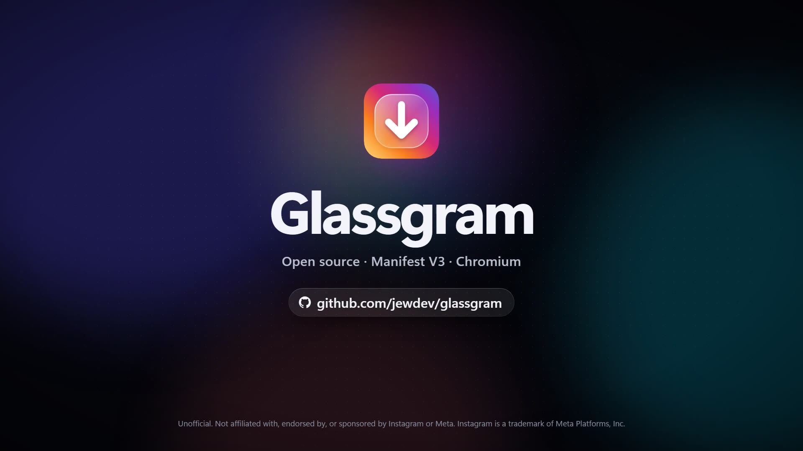

<p align="center">
  
</p>

<h1 align="center">Glassgram</h1>

<p align="center">
  <b>The tools Instagram's website leaves out.</b><br>
  Download media, zoom profile pictures, see who's mentioned in a story, and clean up your feed.
</p>

<p align="center">
  
  
  <a href="LICENSE"></a>
</p>

<p align="center">
  <a href="#install">Install</a> ·
  <a href="#what-you-get">What you get</a> ·
  <a href="#settings">Settings</a> ·
  <a href="#keyboard-shortcuts">Shortcuts</a> ·
  <a href="#privacy">Privacy</a> ·
  <a href="#disclaimer">Disclaimer</a>
</p>

<p align="center">
  <sub>An unofficial project. Not affiliated with, endorsed by, or sponsored by Instagram or Meta.</sub>
</p>

---

## See Glassgram in action

[](https://files.catbox.moe/5fhxnn.mp4)

<sub>Click to play the demo. The Instagram pages in the video are a recreation with fictional accounts.
The Glassgram settings page and popup are the real extension pages.</sub>

## Highlights

|  |  |
| :--- | :--- |
| **⬇️ Download anything** <br> Photos, videos, reels, stories and highlights at full resolution. Carousels and story trays go into one ZIP. | **🔍 HD profile pictures** <br> Hover a profile picture to open it full size, download it, or copy its URL. |
| **🏷️ Story mentions** <br> An **@** button lists everyone mentioned in a story, including mentions the poster hid. | **🤝 Follow badge** <br> Shows next to the username whether someone follows you back. |
| **🧹 A cleaner feed** <br> Hide ads, suggested posts, the Reels and Explore tabs, and more, each one separately. | **🎛️ A switch for every feature** <br> Turn off anything you don't want. |

## Install

Glassgram isn't in a web store yet. Build it once and load it as an unpacked extension.

**1. Build** (needs [Node.js](https://nodejs.org) 20 or later)

```sh
git clone https://github.com/jewdev/glassgram
cd glassgram
npm install
npm run build
```

**2. Load it in your browser**

1. Open `brave://extensions` (or `chrome://extensions`, `edge://extensions`).
2. Turn on **Developer mode**, top right.
3. Click **Load unpacked** and pick the `dist` folder.

The settings page opens on first install. Log in to instagram.com and you're set.

> [!TIP]
> To update, run `git pull` and `npm run build`, press reload on the extension's card, then refresh
> Instagram.
>
> To reach the settings later, click the extension icon and then the gear, or go to **Details →
> Extension options**.

It works on Windows, macOS and Linux, in any Chromium browser with Manifest V3 support: Brave,
Chrome, Edge, Opera, Vivaldi.

## What you get

Where it can, Glassgram reuses data the page already loaded instead of sending its own requests.

### ⬇️ Downloads

- A **download toolbar** on every post, reel and story. Hover the media to download this item,
  download all, copy the media URL or copy the caption. You always get the highest resolution
  Instagram serves.
- **Filename templates** like `Instagram/{user}/{user}_{date}_{shortcode}_{index}`. Use `/` for folders.
- **ZIP or separate files** when saving several at once. ZIP is the default.
- **Bulk profile download**: a floating button on profiles saves the latest N posts, photos and/or
  videos. Off by default.
- **Right-click download** with *Download Instagram media* in the context menu.
- **Voice messages** get a download button in your chats, so you can save one without playing it.
- **Keep unsent messages** remembers the messages people send you. When someone unsends one, it
  stays in the chat with an unsent mark, you get a notice, and it's listed under *Unsent messages*
  in the popup. Received messages are kept from 1 day up to forever; unsent ones stay until you
  clear them. Everything stays in your browser. Off by default.

### 👤 Profiles and stories

- **HD profile pictures** open in a viewer where you can zoom with the wheel, drag to pan, download
  or copy the URL.
- **Story mentions & stickers** shows hidden mentions (shrunk to nothing, flagged hidden, or pushed
  outside the frame), plus hashtags, location, link stickers, music and shared posts.
- The **follow status badge** says *Follow each other*, *Follows you*, *Doesn't follow you back* or
  *Doesn't follow you*. It checks again after you follow or unfollow. Click it for the full picture:
  pending requests, close friends, favorites, mutes, restrict, block and hidden story.
- **No story auto-advance** stops each story at its end, so you move on only when you click. Off
  by default.
- The **unfollowers checker** lists who doesn't follow you back and who you don't follow back, with
  search and CSV export. Long scans save progress and resume later. Off by default.

### 🧹 Feed and video

- **Declutter** hides sponsored posts, suggested posts, the suggestions sidebar, the stories tray,
  the Reels and Explore tabs, and Threads links.
- **Following-only feed** makes Home open the chronological feed of accounts you follow.
- **No accidental likes**: double-clicking a photo doesn't like it.
- **Video controls** add seek, speed, volume and loop to every video and reel. Speed and volume are
  remembered. You can also turn off autoplay.

### 🔒 Privacy and links

- **Clean share links**: "Copy link" drops the `utm_source`, `stkn` and `igsh` tracking parameters
  and can swap in another domain, such as `kkinstagram.com` for Discord and Telegram previews.
- **Direct links** skip Instagram's `l.instagram.com` redirect page.
- **Block analytics** blocks Instagram's event-logging requests.
- **Anonymous story viewing** blocks the "seen" request so you don't appear in the viewer list.
  Off by default.
- **Anonymous live viewing** watches live videos without joining the viewer list. Off by default,
  not tested yet.
- **DM privacy** can hide the typing indicator and the "Seen" receipt.

### ✨ Small extras

- **Exact timestamps** replace "3d" with the real date and time. Hover for the original.
- **Copy comment** puts a *Copy* button next to every comment.
- **Save GIFs from comments** adds *Save GIF* under comments that are a GIF.
- **Keyboard shortcuts** for download, download all, zoom and copy URL. You can rebind them.
- **One settings page**, grouped and searchable, with export and import. A popup holds quick toggles
  for the settings you change most.

## Settings

Open the settings page from the extension's icon, then the gear. Changes apply immediately without a
reload. The one exception is anonymous story viewing, which needs Instagram refreshed. **Reset to
defaults**, **Export settings** and **Import settings** are at the bottom of the page.

<details>
<summary><b>⬇️ Media downloads</b></summary>

| Setting | Default | Notes |
| :--- | :---: | :--- |
| Download toolbar on posts & reels | On | The hover toolbar on photos and videos |
| "Download all" for carousels | On | Shown when a post has several items |
| "Copy media URL" button | On | |
| "Copy caption" button | On | |
| Filename template | `Instagram/{user}/{user}_{date}_{shortcode}_{index}` | Tokens: `{user}` `{shortcode}` `{index}` `{id}` `{date}` `{time}` `{type}` |
| Saving several files | ZIP | One ZIP, or separate files in a folder |

</details>

<details>
<summary><b>📖 Stories and profile</b></summary>

| Setting | Default | Notes |
| :--- | :---: | :--- |
| Download stories & highlights | On | Current story or the whole tray |
| Story mentions & stickers | On | The **@** button and its panel |
| HD profile picture | On | Zoom, download, copy URL |
| Follow status badge | On | Next to the username. Click it for details |
| Don't auto-advance stories | Off | Each story stops at its end |
| Bulk download profile posts | Off | The floating button on profiles |
| Bulk delay between requests | 1.5 to 3.5 s | Spacing for bulk download |

</details>

<details>
<summary><b>📰 Feed and video</b></summary>

| Setting | Default | Notes |
| :--- | :---: | :--- |
| Following-only feed | Off | Home opens the Following feed |
| Disable double-click like | On | |
| Video control bar | On | Seek, speed, volume, loop |
| Disable video autoplay | Off | Stories still play |
| Default playback speed | 1× | 0.5× to 3× |
| Remember volume | On | |
| Loop videos | On | |

</details>

<details>
<summary><b>🧹 Declutter</b></summary>

| Setting | Default |
| :--- | :---: |
| Hide sponsored posts | On |
| Hide "Suggested for you" posts | Off |
| Hide suggested accounts sidebar | Off |
| Hide stories tray on home | Off |
| Hide Reels tab | Off |
| Hide Explore tab | Off |
| Hide Threads banners & links | On |

</details>

<details>
<summary><b>🔗 Links, info and shortcuts</b></summary>

| Setting | Default | Notes |
| :--- | :---: | :--- |
| Exact timestamps | On | Date + time (12h or 24h), or date only |
| Right-click "Download Instagram media" | On | |
| Copy comment button | On | |
| Save GIFs from comments | On | |
| Clean share links | On | Strips tracking from copied links |
| Share domain | Empty | Replaces `instagram.com` in copied links, e.g. `kkinstagram.com` |
| Open links directly | On | Skips `l.instagram.com` |
| Enable keyboard shortcuts | On | Keys are listed [below](#keyboard-shortcuts) |

</details>

<details>
<summary><b>🔒 Privacy, messages and account tools</b></summary>

| Setting | Default | Notes |
| :--- | :---: | :--- |
| Anonymous story viewing | Off | Blocks the story "seen" request |
| Anonymous live viewing | Off | Not tested yet |
| Block analytics | On | Blocks `/ajax/bz`, `/ajax/qm`, `/logging` |
| Download voice messages | On | A download button on each voice message |
| Hide typing indicator | Off | |
| Hide "Seen" | Off | Opening a chat doesn't mark it as read |
| Keep unsent messages | Off | Shown in the chat with an unsent mark, and listed in the popup |
| Remember received messages for | 30 days | 1 day to forever. Unsent messages stay until you clear them |
| Unfollowers checker | Off | Opened from the popup or your own profile |
| Unfollowers scan delay | 2 to 4 s | Spacing for the scan |

</details>

## Keyboard shortcuts

Shortcuts act on the media under the mouse, or on the most visible post when nothing is hovered.
They don't fire while you're typing, and you can rebind all of them in settings.

| Key | What it does |
| :---: | :--- |
| `D` | Download the current photo, video or story |
| `Shift` + `D` | Download all: every carousel item, or the whole story tray |
| `Z` | Open the profile picture full size (on a profile) |
| `Shift` + `C` | Copy the media URL |

In the image viewer, use the wheel to zoom and drag to pan. Double-click or press `0` to reset, and
`Esc` to close.

## Privacy

Everything runs in your browser. There's no server and no analytics, and nothing is sent anywhere
except Instagram and its image servers.

Requests go through your logged-in Instagram session, the same way the website's own requests do,
and the extension never sees your password. It reads two cookies: the CSRF token, which it sends
back to Instagram, and your user ID, which it uses to recognise your own profile. It stores neither.

Settings sync through your browser account (`chrome.storage.sync`). The unfollowers scan and the
remembered volume stay on this device (`chrome.storage.local`).

<details>
<summary>Permissions it asks for</summary>

| Permission | Why |
| :--- | :--- |
| `downloads` | Saving files |
| `storage` | Your settings |
| `contextMenus` | The right-click entry |
| `offscreen` | Building ZIPs |
| `declarativeNetRequest` | Blocking the story "seen" request |
| `instagram.com`, `cdninstagram.com`, `fbcdn.net` | Working on Instagram and loading its media |

</details>

## Limitations

- Glassgram uses Instagram's private web API, which Instagram can change at any time. When something
  breaks, the fix is usually in `src/content/core/selectors.ts` or `src/inject/main-world.ts`.
- Heavy use, such as bulk-downloading large profiles or scanning accounts with many followers, can
  get your account temporarily rate-limited. Keep the default delays.
- Bulk download pages through posts using the same request Instagram's profile grid sends. If you
  open a profile before the extension has seen that request, reload the profile once.
- Ads and suggestions are recognised by their label text, in English and a few other languages.
- Keep unsent messages only catches messages that arrive while Instagram is open in this browser.
  Turning it off forgets the recent messages it was holding; the unsent ones stay until you press
  *Clear all*.
- Block analytics stops Instagram's logging requests. Some analytics also travel over Instagram's
  live connection, mixed in with other traffic, and the extension leaves those alone.
- Downloading someone else's content doesn't give you the right to reuse it. Respect the creators
  and Instagram's terms.

## Development

```sh
npm run dev        # dev build with hot reload (load dist/ the same way)
npm run build      # typecheck and production build into dist/
npm test           # unit tests
```

| Where | What it does |
| :--- | :--- |
| `src/inject/main-world.ts` | Page script. Runs before Instagram's code: caches posts and users, replays profile queries for bulk download, blocks the story "seen" request, cleans copied links, unwraps `l.instagram.com`, stops DM typing and read requests, tags voice messages with their audio URL |
| `src/content/` | Content script, one file per feature in `features/` |
| `src/content/core/selectors.ts` | Every assumption about Instagram's markup |
| `src/background/` | Queues downloads and builds ZIPs in an offscreen document |
| `src/shared/settings-schema.ts` | Every setting, defined once. The settings page and popup are generated from it |

## Disclaimer

Glassgram is an independent, unofficial project. It is not affiliated with, endorsed by, or
sponsored by Instagram or Meta Platforms, Inc. "Instagram" is a trademark of Meta Platforms, Inc.,
used here only to describe what the extension works with.

The extension runs in your browser with your own Instagram session and uses Instagram's private web
interface, which can change at any time. Using it may go against Instagram's Terms of Use, and heavy
use of features such as bulk download or the unfollowers checker can get your account temporarily
rate-limited. You use it at your own risk.

Downloaded photos, videos and voice messages belong to the people who posted or sent them. Only
download what you have the right to keep, and don't republish other people's content without their
permission.

## License

[GNU GPL v3.0](LICENSE)
